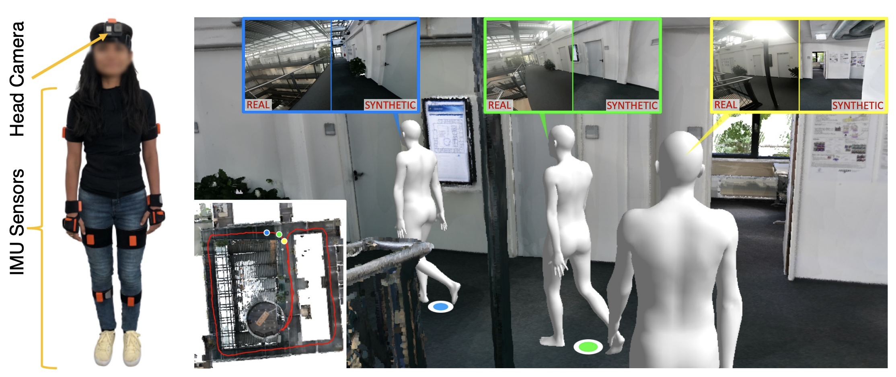
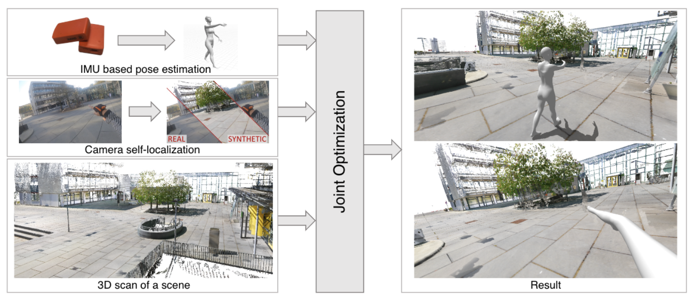

# Human POSEitioning System (HPS): 3D Human Pose Estimation and Self-localization in Large Scenes from Body-Mounted Sensors
>[Human POSEitioning System (HPS): 3D Human Pose Estimation and Self-localization in Large Scenes from Body-Mounted Sensors](https://arxiv.org/abs/2103.17265)  
[Vladimir Guzov*](https://virtualhumans.mpi-inf.mpg.de/people/Guzov.html), [Aymen Mir*](https://virtualhumans.mpi-inf.mpg.de/people/Mir.html), [Torsten Sattler](https://tsattler.github.io/)  , [Gerard Pons-Moll](https://virtualhumans.mpi-inf.mpg.de/people/pons-moll.html)  
*Proceedings of IEEE Conference on Computer Vision and Pattern Recognition 2021*

>(* joint first authors with equal contribution)




 HPS jointly estimates the full 3D human pose and location of a subject within large 3D scenes, using only
wearable sensors. Left: subject wearing IMUs and a head mounted camera. Right: using the camera, HPS localizes the human in a pre-built map of the scene (bottom left). The top row shows the split images of the real and estimated virtual camera
## Getting Started:

Download the scenes used for optimization, predefined vertices, all the IMU txt files and MVNX files, the video files and the camera localization json files

Download the SMPL Model files from [here](https://smpl.is.tue.mpg.de/)

Change the corresponding global variables denoting locations of these files in ``global_vars.py``

Change the location of all the global variables that specify the locations where the data generated by all the processes in this repo should be stored.

Create conda environment 
```
conda env create -f hps_env.yml
```

## Preprocessing

Run Preprocessing code. This computes the frame where the clap - used to synchronize the IMUs with the head mounted camera - occurs. This also generates the foot contact arrays from the mvnx files and processes the txt files to produce basic IMU pkl files. 

Due to copyright concerns, we have not released the audio files associated with the head mounted camera videos. Please use the initialization files provided with the data.
```
python preprocess.py --file_name seq_name 
```

Run Initialization code. This finds the orientation matrix that aligns the IMU coordinate frame with the scene coordinate frame. This generates the IMU bake.pkl files which contain the IMU recovered pose and translation oriented correctly in the 3D scene.
```
python Initialization.py --file_name seq_name 
```

Compute scene normals. These are used for refining sitting frames in the final optimizaiton step. This script processes all the scenes at once.
```
python scene_normals.py 
```
Resample the IMU and contact files. The IMU frames are sampled at 29.97 Hz while the Camera Frames are sampled at 30.0 Hz. This step ensures the two sensors are synchronized properly.
```
python resample.py 
```
Compute Sitting Frames. This uses a heuristic to detect which frames involve sitting motion. All the sequences are processed at once
```
python sit_frames.py 
```
Run the Filter Code. This filters out the erroneous camera localization frames. Incorrectly localized frames are detected based on comparison between IMU velocities and Camera velocities. The erroneous camera localizations are replaced by correctly oriented IMU trajectories. 
```
cd filter
python filter.py --file_name seq_name 
```





## Optimization

Create a config file. A sample file is found in configs folder

Run the optimization code as follows 

```
python main.py --config configs/sample.txt
```

# Citation
If you find our code useful, please consider citing our paper 

```
@inproceedings{HPS,
    title = {Human POSEitioning System (HPS): 3D Human Pose Estimation and Self-localization in Large Scenes from Body-Mounted Sensors },
    author = {Guzov, Vladimir and Mir, Aymen and Sattler, Torsten and Pons-Moll, Gerard},
    booktitle = {{IEEE} Conference on Computer Vision and Pattern Recognition (CVPR)},
    month = {jun},
    organization = {{IEEE}},
    year = {2021},
}

```

# License
This code is available for **non-commercial scientific research purposes** as defined in the [LICENSE file](./LICENSE.txt). By downloading and using this code you agree to the terms in the LICENSE.

# Acknowledgements
The smplpytorch code comes from [Gul Varol's repository](https://github.com/gulvarol/smplpytorch)

The ChamferDistancePytorch code comes from [Thibault Groueix's repository](https://github.com/ThibaultGROUEIX/ChamferDistancePytorch)